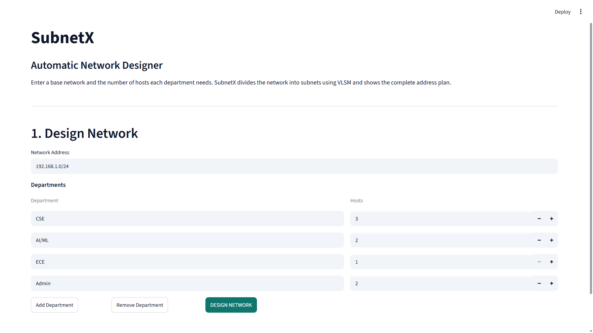
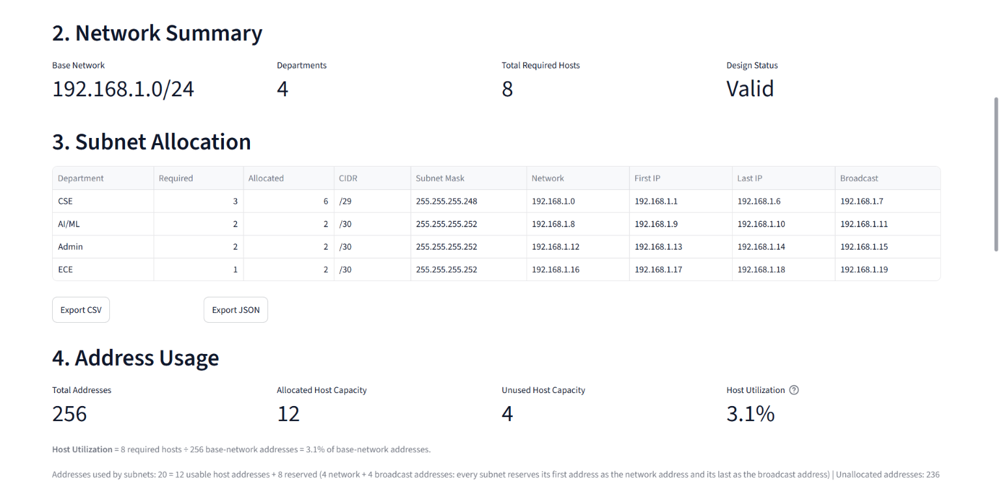
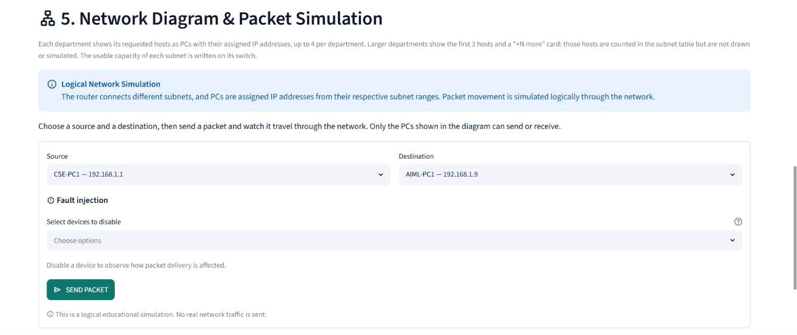
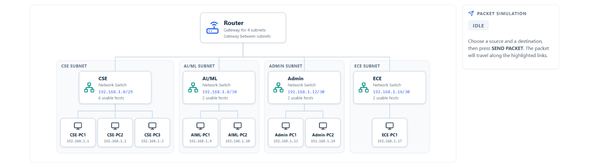
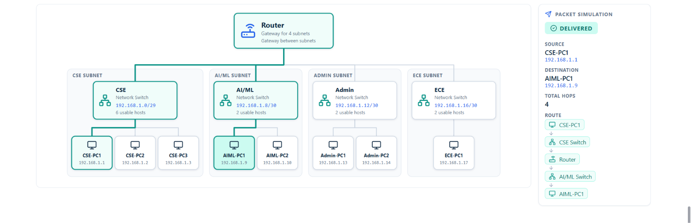

# SubnetX — Automatic Network Designer

A web-based **Computer Networks project** developed using **Python and Streamlit**. SubnetX automatically divides a given network into subnets using **Variable Length Subnet Masking (VLSM)**, generates a complete IP address plan, visualizes the network topology, and simulates packet communication between devices.

---

## Features

- Automatic VLSM subnet allocation
- Input validation for IP addresses and host requirements
- Subnet table with complete address details
- Network utilization and capacity analysis
- Automatic network topology generation
- Router, switches, and PC visualization
- Same-subnet packet communication
- Different-subnet packet communication through router
- Packet simulation with step-by-step path highlighting
- Success and failure status for packet transmission
- CSV and JSON export
- Support for custom destination IP addresses

---

## Tech Stack

| Technology  | Purpose                          |
| ----------- | -------------------------------- |
| Python      | Application Development          |
| Streamlit   | Web Interface                    |
| `ipaddress` | IP Address & Subnet Calculations |
| Pandas      | Data Processing                  |
| Inline SVG  | Network Topology Diagram         |

---

## VLSM Concept

**Variable Length Subnet Masking (VLSM)** allows different departments to receive subnets based on their individual host requirements.

SubnetX follows these steps:

1. Sorts departments from largest to smallest host requirement.
2. Calculates the smallest subnet that can accommodate the required hosts.
3. Allocates the subnets sequentially from the base network.
4. Validates that each subnet fits within the available address space.

This allows the network to use address space more efficiently than fixed-size subnetting.

---

## How the Application Works

```text
User Input
    ↓
VLSM Calculation
    ↓
Subnet Address Plan
    ↓
Network Topology
    ↓
Packet Simulation
    ↓
Communication Result
```

The application accepts a base network and department host requirements. It then generates the subnet allocation, creates a corresponding network topology, and allows packets to be simulated between the generated devices.

---

## Project Structure

```text
SubnetX/
├── app.py
├── subnet.py
├── simulation.py
├── export.py
├── requirements.txt
├── README.md
└── .streamlit/
    └── config.toml
```

---

## Role of Each File

| File                     | Purpose                                      |
| ------------------------ | -------------------------------------------- |
| `app.py`                 | Streamlit interface and application workflow |
| `subnet.py`              | VLSM calculation and input validation        |
| `simulation.py`          | Network topology and packet simulation       |
| `export.py`              | CSV and JSON export                          |
| `requirements.txt`       | Project dependencies                         |
| `.streamlit/config.toml` | Streamlit configuration                      |

---

## Getting Started

### Prerequisites

- Python 3.9+
- pip

### Installation

Clone the repository:

```bash
git clone <repository-url>
cd SubnetX
```

Install the required dependencies:

```bash
pip install -r requirements.txt
```

---

## How to Run

Start the Streamlit application:

```bash
streamlit run app.py
```

The application will be available at:

```text
http://localhost:8501
```

---

## Example

For a base network:

```text
192.168.1.0/24
```

with the following department requirements:

```text
CSE   → 3 hosts
AI/ML → 2 hosts
ECE   → 1 host
Admin → 2 hosts
```

SubnetX generates the corresponding VLSM address plan:

| Department | Required | CIDR | Usable | Network      | First IP     | Last IP      | Broadcast    |
| ---------- | -------- | ---- | ------ | ------------ | ------------ | ------------ | ------------ |
| CSE        | 3        | /29  | 6      | 192.168.1.0  | 192.168.1.1  | 192.168.1.6  | 192.168.1.7  |
| AI/ML      | 2        | /30  | 2      | 192.168.1.8  | 192.168.1.9  | 192.168.1.10 | 192.168.1.11 |
| Admin      | 2        | /30  | 2      | 192.168.1.12 | 192.168.1.13 | 192.168.1.14 | 192.168.1.15 |
| ECE        | 1        | /30  | 2      | 192.168.1.16 | 192.168.1.17 | 192.168.1.18 | 192.168.1.19 |

The generated topology represents the departments using switches and connected PCs.

---

## Packet Simulation

SubnetX provides a logical simulation of network communication.

### Same Subnet

Communication between devices in the same subnet follows:

```text
PC → Switch → PC
```

### Different Subnet

Communication between devices in different subnets follows:

```text
PC → Switch → Router → Switch → PC
```

The router represents the gateway between different subnets.

The application can also simulate failure cases such as:

- Disabled PC
- Disabled Switch
- Disabled Router
- Destination IP outside the network
- Destination host that is not simulated

The packet stops at the point of failure and the reason is displayed to the user.

---

## Network Topology

The application automatically generates a topology containing:

```text
              Router
             /      \
        Switch       Switch
       /  |  \       / |  \
     PC  PC  PC     PC PC PC
```

For departments with more than four requested hosts, the topology displays the first three PCs along with a **"+N more"** indicator. The complete subnet information and host count are still included in the subnet table and exports.

---

## Screenshots

### Network Design



### Subnet Allocation



### Packet Simulation



### Network Topology



### Packet Delivered



---

## Testing

The individual modules can also be tested without starting the Streamlit interface:

```bash
python subnet.py
python simulation.py
python export.py
```

---

## Future Improvements

- Support for IPv6 subnetting
- Larger and customizable network topologies
- Multiple routers
- Dynamic routing simulation
- More detailed packet-level visualization
- Real-time network monitoring
- Additional network failure scenarios

---

## License

This project was developed for educational and learning purposes.
